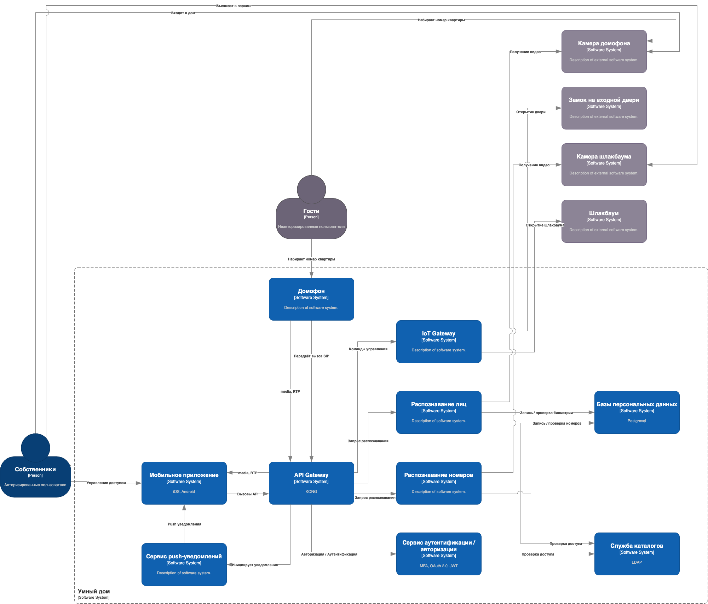
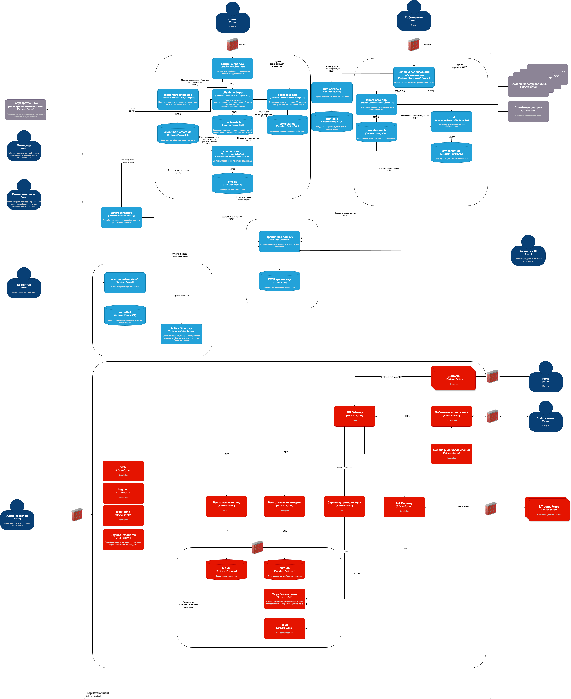

# Задание 3. Внешние интеграции

### Исходники drawio

 - [Context Diagram](../images/Task_3_context_diagram.drawio)
 - [Containers Diagram](../images/Task_3_PropDevelopment_C4_model.drawio)

### Cхемы

#### Диаграмма контекста

#### Диаграмма контейнеров

## Требования безопасности к внешним интеграциям

1. Шифрование данных:

   - Все данные должны передаваться в зашифрованном виде, протокол шифрования `TLS 1.3+`.
   - Чувствительные данные (биометрия, номера автомобилей) должны шифроваться `AES-256` (как на уровне приложения, так и на уровне БД).
   - Ключи шифрования не должны храниться в коде, должны храниться в специализированном хранилище `Vault`.

2. Аутентификация и авторизация:

   - Должна использоваться многофакторная аутентификация MFA для администраторов и собственников.
   - Интеграция IoT-устройств должна происходить по API-ключам
   - API ключи должны регулярно обновляться в соответствии с политикой ротации
   - Устройства - камеры и шлагбаумы должны быть аутентифицированы
   - Аутентификация устройств должна происходить по сертификатам

3. Контроль доступа:
   - К пользователям должна применяться ролевая модель доступа RBAC (Role-Based Access Control)
   - Роли: 
     - Гость (только вызов через домофон),
     - Владелец (управление доступом),
     - Администратор (полный доступ).
   - IoT устройства подключаются из белого списка IP-адресов

4. Мониторинг и логирование:

   - Все сервисы должны регистрировать события аудита в журналах логирования и безопасности
   - Должна быть обеспечена система отчетности по событиям безопасности
   - Отчеты должны проходить регулярный аудит
   - В системе логирования (или аналитики SIEM) должны быть настроены правила и уведомления для обнаружения аномальных событий и событий безопасности
   - В журнала не должно содержаться чувствительной информации
   - Для журналов должна быть обеспечена целостность
   - Все сервисы должны быть обеспечены метриками приложения
   - Метрики приложения должны быть отображены на дашбордах в системе мониторинга
   - В системе мониторинга должны быть выставлены пороги и уведомления для метрик приложения 

5. Отказоустойчивость

 - Подключения к API Gateway из сети Internet должны проходить через Web Application Firewall
 - Подключение API Gateway к сети интернет должно использовать услугу DDoS mitigation. 
 - При недоступности сервисов аутентификации устройства замков и шлагбаумов переходят в локальный режим - по физическому ключу.
 - При аварийном отключении замки и шлагбаумы должны быть разблокированы. 
